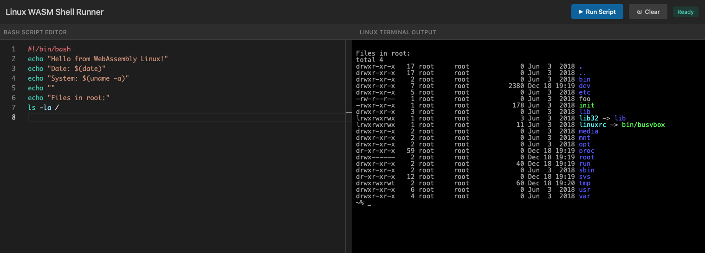

# Linux WASM Shell Runner

A browser-based Linux environment powered by [v86](https://github.com/copy/v86) WebAssembly emulator with an integrated Monaco code editor for writing and executing bash scripts.

**[Live Demo](https://modulovalue.github.io/linux_web/)**



## Features

- Full Linux environment running in your browser via WebAssembly
- Monaco Editor with bash syntax highlighting
- Run scripts with Ctrl/Cmd+Enter
- No server-side execution - everything runs client-side

## Requirements

- Python 3.x (for local development)
- A modern browser with WebAssembly and SharedArrayBuffer support

## Running Locally

1. Clone the repository:
   ```bash
   git clone https://github.com/modulovalue/linux_web.git
   cd linux_web
   ```

2. Start the development server:
   ```bash
   python3 serve.py
   ```

3. Open http://localhost:8888 in your browser

4. Wait for Linux to boot (the button will enable when ready)

**Note:** The included `serve.py` is required because v86 needs `Cross-Origin-Opener-Policy` and `Cross-Origin-Embedder-Policy` headers for SharedArrayBuffer support. A standard HTTP server won't work.

## Usage

1. Write your bash script in the editor on the left
2. Click "Run Script" or press `Ctrl+Enter` / `Cmd+Enter`
3. View the output in the terminal on the right
4. Use "Clear" to clear the terminal output

## License

v86 emulator files are subject to their respective licenses. See [v86 repository](https://github.com/copy/v86) for details.
